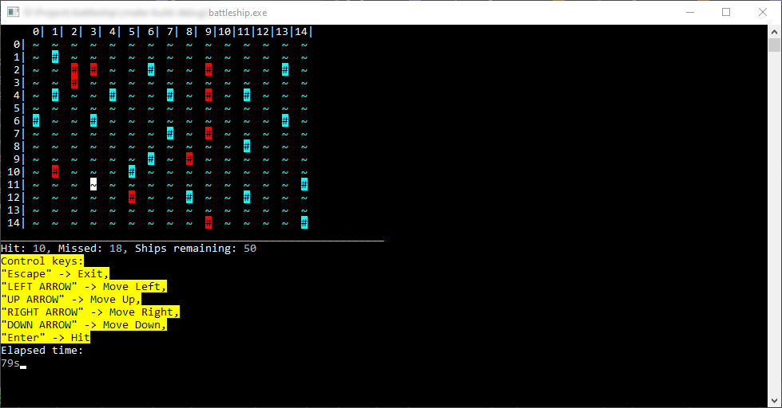

# Battleship

Simple CLI implementation of battleship game in **C language**.

Originally a high school mini project.

## Prerequisites

- **Windows OS** (due to the use of `GetAsyncKeyState()` from `#include <windows.h>`)
- **C Compiler** (such as MinGW or Visual Studio)
- **CMake** (Optional)

## Gameplay example

